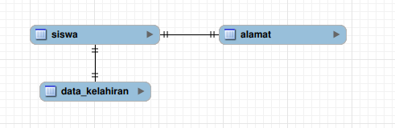
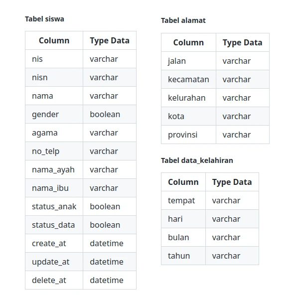
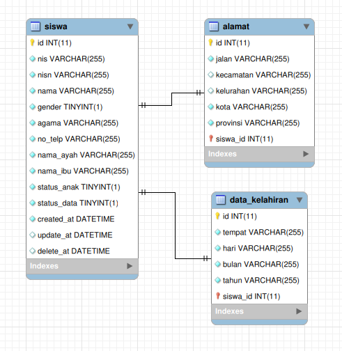

## PROJECT AWAL

Project dengan Framework CodeIgniter serta diintegrasikan dengan adminLTE template dan dengan blade template engine laravel. Project ini dibuat bertujuan untuk menyelesaikan tugas yang diberikan oleh bang arya sebagai senior yang membimbing saya.

### ARSITEKTUR DATABASE

Desain arsitektur sederhana dari database yang akan digunakan dalam projek ini, data terdiri dari 3 tabel setelah saya lakukan normalisasikan model datanya.

#### Conceptual Data Model

Tahap pertama pembuatan arsitektur data base yang terdiri dari konsep konsep atau cetak kasar dari struktur desain

#### Logical Data Model

Pengembangan lebih lanjut dari conceptual data model di atas

#### Physical Data Model

Rancangan akhir dari desain arsitektur database

### RULE

- framework CI 4
- mariaDb
- Template AdminLTE <a href="docs/adminlte_in_codeigniter.md">Cara menggunakan template adminLTE pada CodeIgniter</a>
- Pas data tampil via dataTables mke ajax. Biar kena konsep client side.
- tambah ubah hapus juga mke ajax <a href="docs/konsep_ajax.md">Cara memanfaatkan fitur ajax menggunakan CodeIgniter</a>
- bagian view. Coba cari cara blade laravel on codeigniter <a href="docs/konsep_ajax.md">Cara mengitegrasikan blade dalam CodeIgniter</a>
- coba perhatiin ada kolom status data, create, update, delete. Nahh skrng gimna
  - cara nya pas dihapus data ttp ada. (soft delete)
  - cara pas datanya ubah (ke record tgll berapa diubah)
  - pas ditambah (ke record ditambah nya kapan)
- Pengumpulan: tanggal 13
